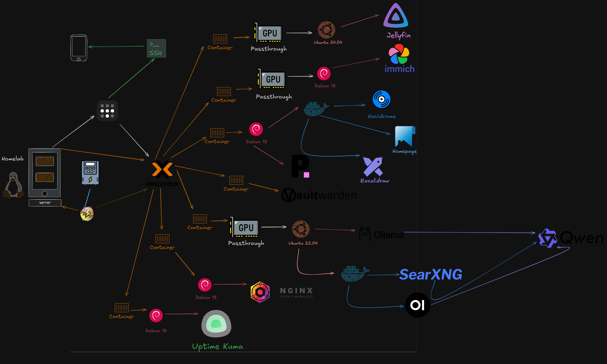

# 🏠 Homelab

> Mi laboratorio personal para aprender virtualización, Linux, Docker, inteligencia artificial, redes e infraestructura.

---

# 📖 Acerca del proyecto

Este repositorio documenta mi homelab, un entorno donde experimento con tecnologías utilizadas en infraestructura moderna, DevOps y computación en la nube.

Mi objetivo no es solamente instalar servicios, sino comprender cómo se implementan, administran, monitorean y mantienen sistemas similares a los que se utilizan en entornos reales.

Cada servicio que agrego está documentado para registrar el proceso de instalación, configuración y las decisiones técnicas tomadas.

---

# 🎯 Objetivos

- Aprender administración de Linux.
- Profundizar en Docker y contenedores.
- Administrar infraestructura con Proxmox.
- Construir un asistente de IA completamente local.
- Aprender redes y servicios self-hosted.
- Mejorar mis conocimientos de infraestructura y DevOps.
- Documentar todo el proceso de aprendizaje.

---

# 🖥️ Hardware

| Componente | Especificación |
|------------|----------------|
| CPU | AMD Ryzen 7 2700X |
| RAM | 16 GB DDR4 |
| GPU | AMD Radeon RX 9060 XT 16GB Vram |
| Motherboard | MSI B450M A PRO MAX |
| Almacenamiento | 1 M.2 - 2 SSD - 1 HDD|
| Hipervisor | Proxmox VE |
| Respaldo eléctrico | UPS con NUT |

---

# 🧰 Tecnologías utilizadas

## Virtualización

- ✅ Proxmox VE
- ✅ Máquina Virtual Debian

## Contenedores

- ✅ Docker
- ✅ Docker Compose

## Inteligencia Artificial

- ✅ Ollama
- ✅ Open WebUI
- ✅ Puck (Asistente de IA Local)

## Servicios Self-Hosted

- ✅ Navidrome
- ✅ NUT (Monitoreo de UPS)

---

# 🚧 Próximos servicios

- ⏳ Nextcloud
- ⏳ Vaultwarden
- ⏳ Excalidraw
- ⏳ Homepage Dashboard
- ⏳ Reverse Proxy
- ⏳ HTTPS
- ⏳ Prometheus
- ⏳ Grafana
- ⏳ Authentik
- ⏳ Tailscale

---

# 📂 Estructura del repositorio

```
.
├── docs/
├── services/
├── diagrams/
├── docker/
└── README.md
```
<p align="center">
  
  <br>
  <em>Diagrama de arquitectura del Homelab en Proxmox (Excalidraw)</em>
</p>

La documentación irá creciendo junto con el homelab.

---

# 📚 Documentación

Cada servicio contará con su propia documentación, incluyendo:

- Objetivo del servicio.
- Instalación.
- Configuración.
- Arquitectura.
- Redes.
- Volúmenes y persistencia.
- Backups.
- Problemas encontrados.
- Posibles mejoras.

---

# 🗺️ Roadmap

- [x] Proxmox
- [x] Docker
- [x] Debian
- [x] Ollama
- [x] Open WebUI
- [x] Puck
- [x] Navidrome
- [x] NUT
- [ ] Nextcloud
- [ ] Vaultwarden
- [x] Excalidraw
- [ ] Homepage
- [ ] Reverse Proxy
- [ ] HTTPS
- [ ] Monitoreo
- [ ] Prometheus
- [ ] Grafana
- [ ] Authentik
- [ ] Ansible
- [ ] Kubernetes

---

# 💡 ¿Por qué este proyecto?

Creo que la mejor forma de aprender infraestructura es construyendo.

Este homelab me permite experimentar con tecnologías utilizadas en empresas, cometer errores, resolver problemas y documentar cada aprendizaje.

Mi objetivo es seguir ampliando este laboratorio mientras avanzo en mi formación como desarrollador y continúo aprendiendo sobre infraestructura, automatización y computación en la nube.

---

## 🚀 Estado del proyecto

Proyecto en desarrollo activo.

La infraestructura y la documentación se actualizan constantemente a medida que incorporo nuevos servicios y tecnologías.
